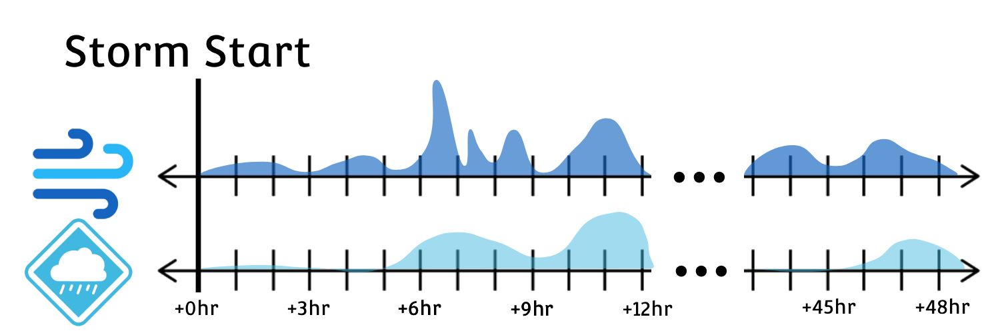

<!------------------------ CSS SETUP --------------------------->

<!---------------------------------------------------------------->

<section data-auto-animate data-background="images/helene_over_us.gif" data-background-repeat="repeat" data-background-size="800px">
  <h2 style="text-align: center;">When Only Extremes Matter</h2>

  

    
  

</section>

<section data-auto-animate>
  <h2 style="text-align: center;">Information Content</h2>

  
Using extreme value features, prediction accuracy is highly sensitive to the data's temporal resolution.

  

  
Why? Storm severity can get "lost in the cracks"

</section>

<section data-auto-animate>
  <h1 style="text-align: center;">The Path Forward</h1>
</section>

<section data-auto-animate>
  <h2 style="text-align: center;">High-Resolution Rapid Refresh</h2>

  
The good news is that better weather predictions are here, which in turn can help our outage predictions!

  <table style="width: 100%; border-collapse: collapse; text-align: center;">
    <thead>
      <tr>
        <th style="border-bottom: 2px solid #ccc; padding: 10px;">Legacy Res.</th>
        <th style="border-bottom: 2px solid #ccc; padding: 10px;">New Resolution</th>
        <th style="border-bottom: 2px solid #ccc; padding: 10px;">Improvement</th>
      </tr>
    </thead>
    <tbody>
      <tr>
        <td style="padding: 10px;">1 hour temporal</td>
        <td style="padding: 10px;">15 minute temporal</td>
        <td style="padding: 10px;">4× higher resolution</td>
      </tr>
      <tr>
        <td style="padding: 10px;">9km spatial</td>
        <td style="padding: 10px;">3km temporal </td>
        <td style="padding: 10px;">9× higher resolution</td>
      </tr>
    </tbody>
  </table>
</section>

<section data-auto-animate>
  <h2 style="text-align: center;">HRRR Dataset Overview</h2>
  
  
a

</section>

<section data-auto-animate>
  <h2 style="text-align: center;">Problem Introduction</h2>
  
a

</section>