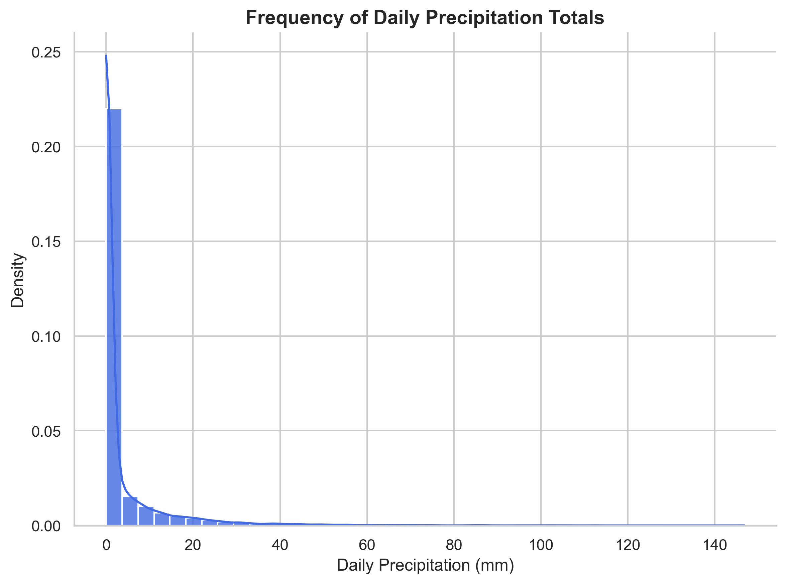

<!------------------------ CSS SETUP --------------------------->

<!---------------------------------------------------------------->

<section data-auto-animate data-background="images/helene_over_us.gif" data-background-repeat="repeat" data-background-size="1000px">
  <h2 style="text-align: center;">Somtimes, Only Extremes Matter</h2>

  

  
  

</section>

<section data-auto-animate>
  <h2 style="text-align: center;">Data Overview</h2>
  
a

</section>

<section data-auto-animate data-background="images/precip_animation.gif" data-background-repeat="repeat" data-background-size="1250px">
  <h2 style="text-align: center;">a</h2>

  

  
Hello world!

  

</section>

## Image credits

- Slide 2: Helene gif https://commons.wikimedia.org/wiki/File:2024_CIMSS_09L_Helene_visible_infrared_satellite_loop.gif
- Slide 3: 

- NC Lake devastation - https://www.latimes.com/opinion/story/2024-10-04/hurricane-helene-north-carolina-climate-change